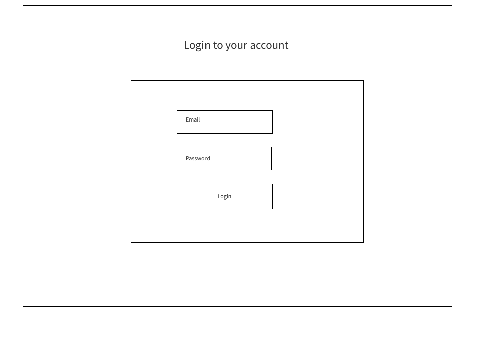
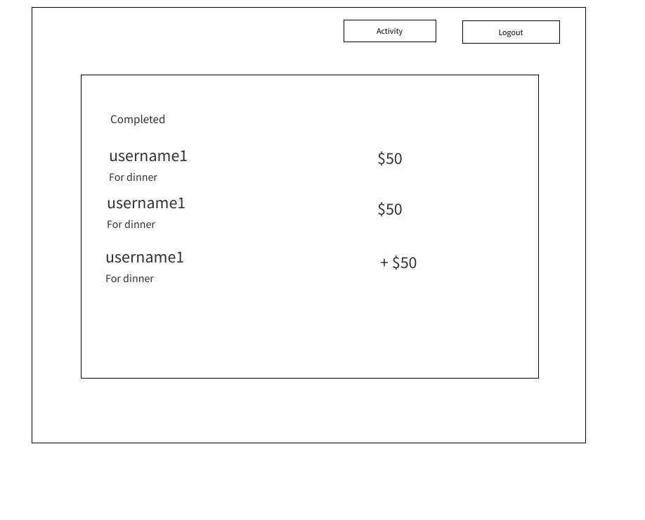

# easy-pay-frontend

As the FinTech sector keeps growing everyday, I though it would be nice to jump right in and start exploring its ins and outs by creating a platform where people can send and recive money from friends.

## Wireframes

## User Stories

1. When a user clicks sign up button, a form is displayed to submit the info and be redicted to the activity page on success.

2. When a user clicks login button, a form is displayed to submit the info and be redicted to the activity page on success.

3. When a user clicks the My activity page, a list of all the user transactions is displayed

4. When a user clicks on the add cash button, the amout is added to the user's account.

## ERD

## MVP

1. Allow user registration
2. Allow user authentication
3. Allow user to send and receive money from other users.
4. Allow user to top up his account balance.

## Stretch Goals

1. To use exteranl API to allow user to add payment method(Bank account or Credit card)

2. Use an external payment gateway to support topping up of money from bank or credit card to user account

3. To allow a user to make a transaction using a bank account or credit card.

